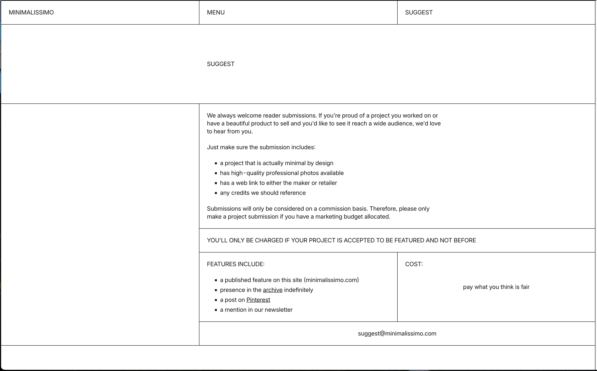

# Flexbox-&-Grid-Assignment

Your task is to replicate the website using `FLEXBOX` and `GRID`.

Try to replicate it as much as possible based on the screenshot below. This screenshot was taken from the following URL: [Minimalissimo Suggest](https://minimalissimo.com/suggest).

You do not have to make it responsive like the actual website; the main target is to replicate the example website to get more familiarity with Flexbox and Grid.

You DO NOT have to replicate the entire website, but only up until the point in the screenshot.

You are not provided with any `index.html` or `styles.css` file, so you have to create and link them.

## Instructions

1. **Create the HTML and CSS Files:**
   - Create an `index.html` file.
   - Create a `styles.css` file.
   - Link the `styles.css` file to the `index.html`.

2. **Use Flexbox and Grid:**
   - Utilize Flexbox and Grid layout techniques to replicate the layout in the screenshot.

